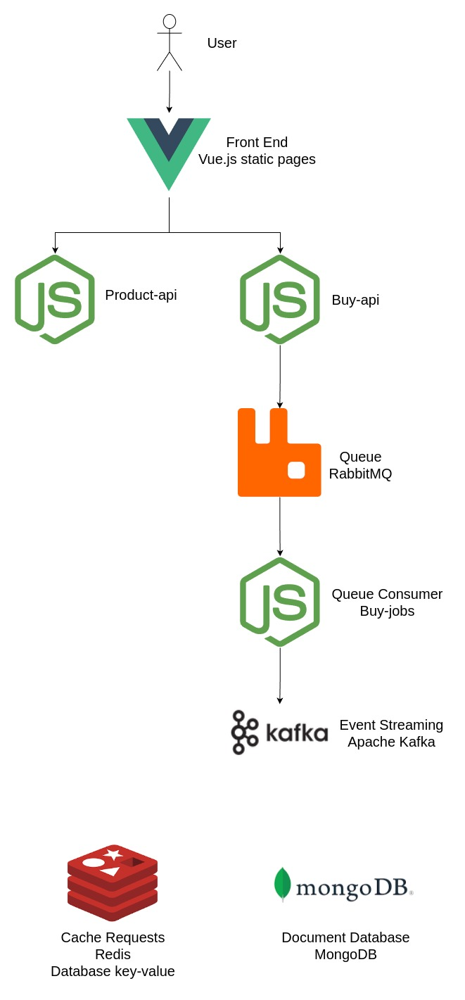

# About

This project was created to test and refresh my skills wih:

- Backend node.js
- Front Vue.js
- Document Database mongoDB
- Queue with RabbitMQ
- Events with Kafka

## How it works

### Front end

It has a simple front-end with Vue.js. The Vue generates a static page who list all products requesting the product-api.

### Product API

The product API is a node.js service with:

- Express to create the API
- Mongoose to manage the Document Database for Products
- Redis for Cache the responses

### Apache benchmark-test

Apache Benchmark Test is a tool who makes a benchmark to test the time spend on requests.

Verify the README on this folder to run and make your own tests

### Buy-api

On the list of products, you can click to buy the product (fake, of course).

When click on it, the buy-api will receive the request and save the information of product bought on a Queue in RabbitMQ.

### Buy-job

This project receive the product bought in Queue and process it.

After bought, service generates an Event on Kafka.

# Docker compose

To dev and test the applications, I created a docker compose configuration.

The docker compose start the environment with all envs who the apps need.

## Dev Environment

docker compose -f docker-compose-dev.yml up

## Local tests with image builds

docker compose up

## How to test

http://localhost:8080/

## Logs

docker compose logs -f

